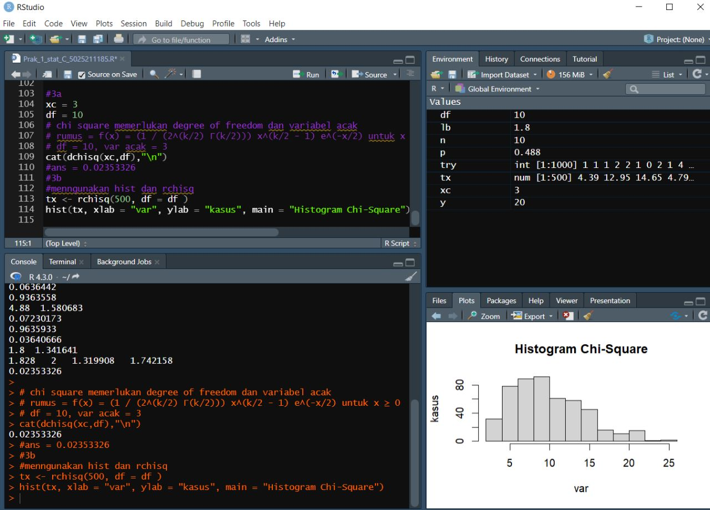

# Prak1_Probstat2023_C_5025211185
Rano Noumi Sulistyo 
5025211185
Probstat C

# 1
Disini kita mendapatkan 2 nilai, kemungkinan lahir laki laki : 0.488 dan jumlah anak yang lahir : 10
## 1a
Dengan konteks kelahiran, bisa disimpulkan bahwa terdapat 2 kemungkinan, laki atau perempuan.
Dan dikarenakan terdapat lebih dari 1 kasus. Distribusi bisa dibilang menjadi distribusi binomial
Binnomial memiliki rumus **P(X=k) = (nCk) p^k (1-p)^(n-k)**
dengan nilai yang diketahui lalu didapat rumus
**P(X=k) = (10Ck) 0.488^k (1-0.488)^(10-k)**

## 1b
Untuk kemungkinan lahir 3 anak laki laki berarti kita perlu memasukkan nilai 3 dalam rumus pdf 
**P(X=3) = (10C3) 0.488^k (1-0.488)^(10-3)**
Dalam R ini berarti menggunakan dbinom(n,k)
Didapat nilai **0.1286265**

##1c
kita diminta untuk menghitung peluang kurang dari 3 laki laki
ini berarti jumlah kemungkinan laki 0, 1, dan 2. ini berarti kita menggunkaan rumus kumulatif 
kita gunakan pbinom yang merupakan kumulatif binom dalam r
Didapat hasil **0.0636442**

## 1d
disini kita perlu menghitung peluang 3 dan lebih dari 3
berarti kita menggunakan kebalikan dari pbinom 1c atai 1 - pbinom c
Didapat hasil **0.9363558**

## 1e
dalam distribusi binomial, nilai harapan adalah np yaitu expected number 
n * p = **4.88**
sementara nilai simpanagan baku atau standar deviasi adalah akar dari varian
varian dari binomial adalah npq q= 1-p
sqrt(n* p *q) = **1.580683**

## 1f

# 2
Disini kita mendapatkan nilai rentang waktu 10 tahun dan rata rata kejadian 1.8. serta ruang lingkup pabrik

## 2a
Distribusi yang memiliki ciri ciri rata rata kejadian dan ruang lingkup adalah poisson
Poisson memiliki rumus **P(X=k) = e^(-λ) (λ^k / k!)**
lambda atau rata rata = 1.8 dan terjadi dalam rentang 20 tahun
**e^(-1.8) * 1.8^k / k!**

## 2b
dilaporkan terjadi 4 kasus dalam kalangan pekerja pabrik ban
tidak ada spesifik waktu, namun dalam prediksi rata ratanya selama 20 tahun 1.8
4 labih dari 2x rata rata. sehingga bisa dibilang abnormal
Menghitung dengan dpois kemungkinannya
kemungkinan adalah **0.07230173** atau **7%** tidak wajar namun relatif mungkin terjadi
tidak ada detail rentan waktu, sehingga tidak bisa pasti ketidakwajarannya

## 2c
kemungkinan paling banyak 4 berarti peluang dari 0-4
menggunakan cumulative density function, yang menghitung dan menambah semua peluang dari 0-4
Dalam R adalah ppois
Dapat hasil **0.9635933**

## 2d
kemungkinan lebih dari 4 kasus, berarti kebalikan dari 2c
1 - cdf dari kasus 0-4
didapat hasil **0.03640666**

## 2e
dalam distribusi poisson varian dan nilai harapan sama yaitu sesuai dengan lambda
dalam kasus ini lambda adalah 1.8
sehingga nilai harapan = **1.8**
dan standar deviasi adalah sqrt(1.8) = **1.341641**

## 2f
buat gambar graphnya dalam bentuk histogram, kita gambar dari 1-10 karena lambda 1.8 sehingga gambar tidak terlalu lebar

## 2g
simulasi dengan beberapa kali denga rpois dengan lambda yang telah ada 1.8
kali ini coba kita coba 1000 kali secara random. agak tinggi agar lebih akurat

## 2h
Kita lalu bandingkan dengan 2d
Kita bisa menghitung mean, median, varian dan standar deviasi nya
avg = 1.813  median = 2 sd = 1.333345 var=1.777809
Bisa dilihat rata rata dekat dengan lambda, median dengan dengan nilai bulat terdekat lamda, var dan standar deviasi eror desimal

# 3
Kita mendapatkan informasi tentang sebuah distribusi chi-square yang memiliki x = 3 dan v = 10

## 3a
chi square memerlukan degree of freedom dan variabel acak
rumus adalah **f(x) = (1 / (2^(k/2) Γ(k/2))) x^(k/2 - 1) e^(-x/2) untuk x ≥ 0**
df = 10, var acak = 3 
f(x) = (1 / (2^(10/2) Γ(10/2))) x^(10/2 - 1) e^(-3/2) untuk x ≥ 0
Hasil adalah **0.02353326**

## 3b
menngunakan hist dan rchisq kita bisa melihat histogram dari percobaan acak yang dibuat dari rchisq 
rchisq dilakukan 500 kali dengan parameter derajat kebebasan 10

## 3c
rataan dari chi square adalah derajat kebebasannya
sementara variannya adalah 2 kalinya dari itu
sehingga rataan = **1.8**
dan varian adalah 2*1.8 = **3.6**

# 4
disini kita diminta untuk menganalisis sebuah distribusi normal yang disimulasi dengan parameter tertentu

## 4a
num = 100 
mean = 45 
sd = 5
dengan 100 nilai, rata rata 45, dan standar deviasi 5 kita akan membuat graph distribusi baru
kita perlu mensimulasi dengan rnorm
Lalu kita pertama cari mean dan di dapat nilai 45.36216233
Dari sini kita cari x1 x2 yaitu floor dan ceiling mean
masing masing 45 dan 46
Dari sini kita cari z score dengan rumus  X - μ / σ
untuk x1 ditemui z score = - 0,03931083
x2  memiliki z score = 0.1776456 
lalu kita dapatkan probabilitar dengan melakukan perhitungan kumulatif x1 dikurangi kumulatif x2
dan didapat -0.07925971, karena probabilitas harus positif nilai sebenarnya adalah 
**0.07925971**

## 4b
histogram dari distribusi Normal yang sebelumnya telah disimulasi dengan breaks 50

## 4c 
rumus varian jika sd tidak ada s^2 = Σ(xi - x̄)^2 / (n-1)
dalam R hanya perlu menggunkan var(ext) 
nilainya adalah **21.24491**

# 5
no 5 kita akan mengerjakan macam macam soal berrelasi dengan distribusi T student, yaitu distribusi yang mirip dengan normal, namun lebih tipis ujungnya dikarenakan sample nilai lebih kecil

## 5a
peristiwa acak X kurang dari -2,34 dengan 6 derajat kebebasan
berarti x<-2.34 
dengan kumulatif yaitu pt 
rumus : = Γ((ν+1)/2) / (√(νπ) Γ(ν/2)) (1 + (x^2 / ν))^(-(ν+1)/2) untuk -∞ < x < ∞
hasilnya adalah **0.02892197** 

## 5b
peristiwa acak X lebih dari 1,34 dengan 6 derajat kebebasan
lebih dari berarti menggunakan 1 - kurang dari kumulatif
1 - pt(1.34, 6)
hasilnya adalah **0.11438**

## 5c
peristiwa acak X kurang dari -1,23 atau lebih besar dari 1,23 dengan 3 derajat kebebasan
bararti memilki bentuk X<-t X>t. Bisa digambarkan sebagai ujung kiri tambah ujung kanan
pt(-1.23, 3) + (1 - pt(1.23, 3))
Hasilnya adalah **0.306356**

## 5d
peristiwa acak X berada di antara -0,94 dan 0,94 dengan 14 derajat kebebasan
memilki range -t< X > t . bisa digambar sebagai batas atas ke kiri, dikurangi batas kiri ke kiri
pt(0.94, 14)) - pt(-0.94, 14)
Hasilnya adalah **0.6368457**

## 5e
5 derajat kebebasan yang memiliki luasan 0,0333 satuan persegi di bawah kurva dan di sebelah kiri t-score
tidak diketahui x, dan diketahui luasan dan derajatnya 
format range adalah X<-t
menggunakan qt, sebelah kiri berarti tidak perlu diubah dari format qt R
Hasilnya adalah **-2.337342**

## 5f
25 derajat kebebasan yang memiliki luasan 0,125 satuan persegi di bawah kurva dan di sebelah kanan
titik kanan, dengan range X>t
karena probabilitas adalah 0.125. kita bisa mendapatkan nilai dengan melakukan 1 - prob. sehingga nilai sisi kanan didapatkan
Hasilnya adalah **1.177716** 

## 5g
11 derajat kebebasan yang memiliki luasan 0,75 satuan persegi di bawah kurva dan di antara t-score tersebut dan negatif
berarti memiliki range X<-t X>t
qt(0.75 + (1-0.75)/2, 11 )
hasil adalah **1.21446**

## 5h
23 derajat kebebasan yang memiliki luasan 0,0333 satuan persegi di bawah kurva dan di luar interval antara t-score tersebut dan negatif
sehingga memiliki range -t< X >t
qt(1 - (0.0333/2), 23 )
hasil adalah **2.264201**

